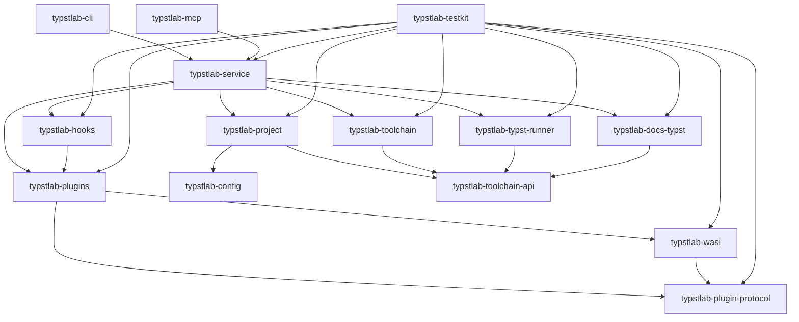

```mermaid
graph TD
  CLI[typstlab-cli] --> SVC[typstlab-service]
  MCP[typstlab-mcp] --> SVC

  SVC --> PROJ[typstlab-project]
  SVC --> HOOKS[typstlab-hooks]
  SVC --> TOOLCHAIN[typstlab-toolchain]
  SVC --> RUNNER[typstlab-typst-runner]
  SVC --> DOCS[typstlab-docs-typst]
  SVC --> PLUGINS[typstlab-plugins]

  PROJ --> CFG[typstlab-config]
  PROJ --> TAPI[typstlab-toolchain-api]

  TOOLCHAIN --> TAPI
  RUNNER --> TAPI
  DOCS --> TAPI

  HOOKS --> PLUGINS
  PLUGINS --> WASI[typstlab-wasi]
  PLUGINS --> PPRO[typstlab-plugin-protocol]
  WASI --> PPRO

  TEST[typstlab-testkit] --> SVC
  TEST --> PROJ
  TEST --> TOOLCHAIN
  TEST --> RUNNER
  TEST --> DOCS
  TEST --> HOOKS
  TEST --> PLUGINS
  TEST --> WASI
  TEST --> PPRO
```
